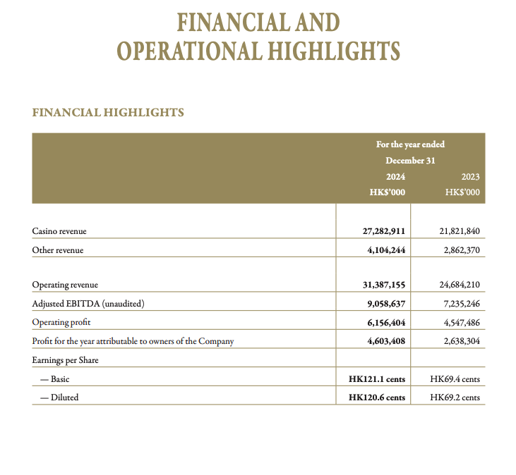

# GenAI Document Understanding

This project demonstrates how to use OpenAI's API to analyze images and answer questions based on their content.

## Flow

1.  **Load Environment Variables**: The script loads necessary environment variables, including the OpenAI API key, from a `.env` file.
2.  **Initialize OpenAI Client**: An OpenAI client is created using the loaded API key.
3.  **Image Processing**:
    *   The script takes an image file path as input.
    *   It determines the MIME type of the image.
    *   The image is read and converted into a base64 encoded data URL.
4.  **OpenAI API Interaction**:
    *   The data URL of the image and a user-defined question are sent to the OpenAI API (specifically, the `o4-mini` model, which can be configured).
    *   The prompt to OpenAI is structured to ask it to answer the user's question using the provided image.
5.  **Output**:
    *   The script logs the process, including image conversion status and the question being asked.
    *   The analysis (answer) received from OpenAI is then logged.

## Setup

1.  **Clone the repository (if applicable).**
2.  **Create a virtual environment (recommended):**
    ```bash
    python -m venv venv
    source venv/bin/activate  # On Windows use `venv\Scripts\activate`
    ```
3.  **Install dependencies:**
    ```bash
    pip install -r requirements.txt
    ```
4.  **Create a `.env` file** in the root of the project and add your OpenAI API key:
    ```
    OPENAI_API_KEY='your_openai_api_key_here'
    ```
    You might also need to set `OPENAI_API_BASE` if you are using a proxy or a non-standard OpenAI API endpoint.

## Running the Script

Execute the `image_analyzer.py` script from the root directory:

```bash
python image_analyzer.py
```

## Example

The script includes a test image located at `data/test_images/data_table.png`.

**Test Image (`data/test_images/data_table.png`):**



**Sample Question:**

"Based on the image, what is the Operating Profit for 2023'?"

**Answer**

The Operating Profit for 2023 is HK$ 4,547,486 thousand.

**Sample Log Output:**

```
2025-05-23 13:34:03,982 - INFO - Using image: /Volumes/work_ext/work/GenAIDocumentUnderstanding/data/test_images/data_table.png
2025-05-23 13:34:03,984 - INFO - Successfully converted image to data URL (first 7 chars): data:im...
2025-05-23 13:34:03,984 - INFO - Asking OpenAI the question: 'Based on the image, what is the Operating Profit for 2023'?' using the image 'data/test_images/data_table.png'
2025-05-23 13:34:09,313 - INFO - HTTP Request: POST https://api.openai.com/v1/chat/completions "HTTP/1.1 200 OK"
2025-05-23 13:34:09,316 - INFO - OpenAI's Analysis:
2025-05-23 13:34:09,316 - INFO - The Operating Profit for 2023 is HK$ 4,547,486 thousand.
```

## Logging

The script uses the `logging` module to output information about its execution. By default, logs are printed to the console.
